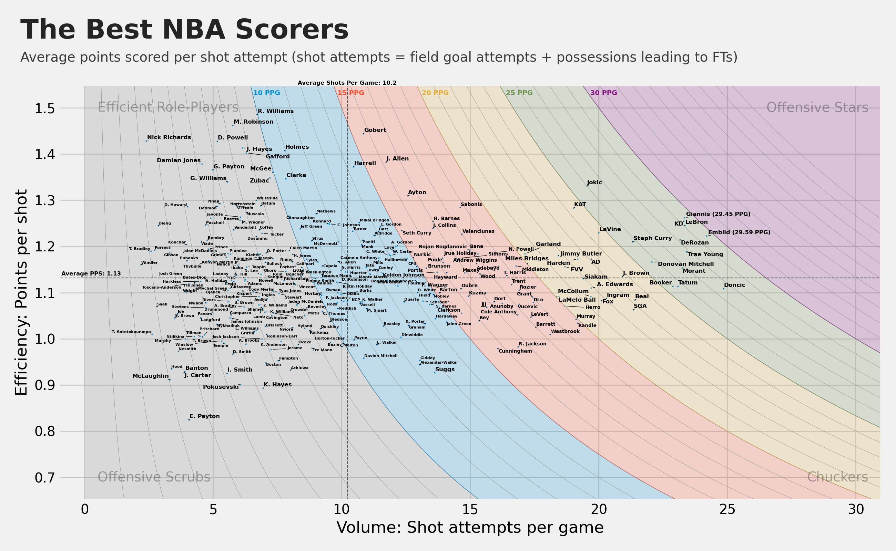

# The Best NBA Scorers

This repository analyzes NBA players' scoring efficiency and volume using shot attempts and points per shot attempt (PPS).

## Overview
The chart below (`Figure_1.png`) shows players' shot attempts per game (volume) and points per shot (efficiency). Background bands represent different points-per-game (PPG) thresholds.

- **Efficient Role Players:** High efficiency, low volume
- **Offensive Stars:** High efficiency, high volume
- **Offensive Scrubs:** Low efficiency, low volume
- **Chuckers:** Low efficiency, high volume



## Data Processing Steps
- Merged `scoring_2_19.csv` and `fouls_2_19.csv` by player name.
- Calculated key metrics: shots, PPS, shots per game, and estimated fouls.
- Created player name abbreviations for clarity on the chart.
- Filtered players who played at least 60% of games.

## Visualization
- Plotted with `matplotlib` and `seaborn`.
- Curves indicate PPG thresholds.
- Used `adjustText` to reduce label overlap.

## How to Reproduce
### Requirements:
- `pandas`, `numpy`, `matplotlib`, `seaborn`, `adjustText`

### Run:
Save the script as `nba_scorers.py` and execute:
```bash
python nba_scorers.py
```
The chart will be saved as `scorers.png`.

## Author
Andrew Kim

